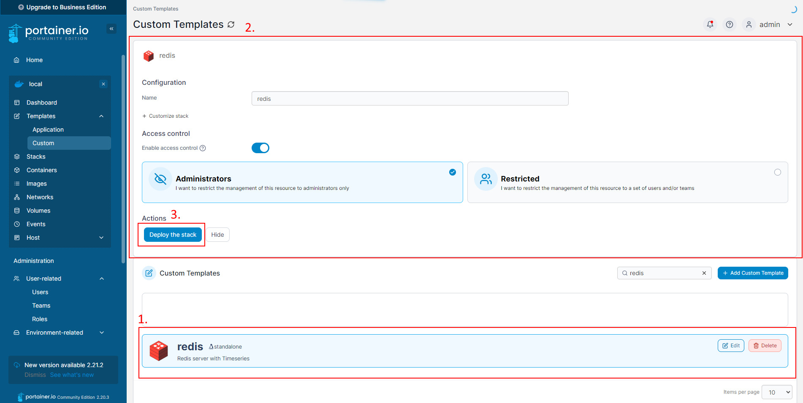

# Notipy.py
Downloads and stores various API data to a Redis server!

This guide will help you get a new Redis Timeseries server up and running, or if you already have one, you can skip to the .env file configuration section and get started immediately!

## Requirements
- a running Docker instance for running Redis
- either a running Portainer instance (preffered), OR knowledge on how to use Docker Compose files.

## Setting up Redis on Portainer
This guide assumes you have Docker already, and will not explain how to setup Docker. We will use Portainer in this guide, but you can always simply use the docker-compose.yml format below instead if you don't wish to use Portainer and know what you are doing.

### 1. Log into your Portainer interface
Click **Live Connect** to connect to your Docker environment, if not connected already.


### 2. Navigate to Custom Templates
Expand **Templates**, then click **Custom**.


### 3. Create a new Custom Template
Click the **+ Add Custom Template** button.


### 4. Configure the Redis Timeseries Template
Fill out the **Title** field and **Description** fields.

(Optional) if you want to be official, you can use this image url in the **Logo** field to have the template use Redis's official app image:
> https://avatars.githubusercontent.com/u/1529926?s=200&v=4


Copy / Paste the below **Custom Template** code and paste it into the large **Web editor** field on the **Create Custom template** page.

**Custom Template Code:** (aka the **docker-compose.yml**)

```
services:
  redistimeseries:
        image: 'redislabs/redistimeseries'
        volumes:
        - redis-data:/data
        - redis-config:/config
        environment:
          - ALLOW_EMPTY_PASSWORD=yes
          - REDIS_CONF_DIR=/config
          - REDIS_DATA_DIR=/data
        ports:
          - 6379:6379

volumes:
  redis-data:
  redis-config:
```

**Web Editor** field filled out:


After pasting in, click the **Create Custom Template** button.

### 5. Deploy the Redis Template
Click on the Redis template under Custom templates. Doing so will select it, and it will appear at the top of the Custom Templates page as the actively selected template.



Click **Deploy The Stack**.
Redis should be up and running now!

### 6. Setup notipy.py
Clone this repo to your computer:
```
git clone https://github.com/Silverlink34/notipy.git
```
Edit the .env file in the downloaded files, using the below reference to fill out each option.
|.env Value Name|Description|Example Value|
| ------------- |-------------| ----|
|WEATHER_API_KEY|openweatherapi key|32charkey|
|CITY|define city for weather|Newark|
|STATECODE|2 char State|OH|
|STOCK_API_KEY|not used yet|na|
|STOCK_SYMBOL|not used yet|na|
|NEWS_API_KEY|newsapi key|32charkey|
|NEWS_KEYWORDS|comma separated list of news words|Minecraft,Zelda,Earth|
|STEAM_APPID|not used yet|na|
|STEAM_GAME_NAME|not used yet|na|
|STEAM_GAME_PRICE_THRESHOLD|not used yet|na|
|EMAIL_TO_NOTIFY|not used yet|na|
|EMAIL_FROM_ADDRESS|not used yet|na|
|EMAIL_FROM_PASSWORD|not used yet|na|
|WEATHER_RUN_INTERVAL_MINUTES|minute interval to run|60|
|NEWS_RUN_INTERVAL_MINUTES|minute interval to run|60|
|REDIS_HOST|redis server ip/hostname|192.168.1.10|
|REDIS_PORT|redis port|6379|
|REDIS_TS_HOST|ts redis ip/hostname|192.168.1.10|
|REDIS_TS_PORT|redis port|6379|
|SQLITE_FILE_PATH|not used yet|na|

Here is a .env file filled out as an example:
```
WEATHER_API_KEY=xxxxxxxxxxxxxxxxxxxxxxxxxxxxxxxx
CITY=Buckeye Lake
STATECODE=OH
STOCK_API_KEY=
STOCK_SYMBOL=
NEWS_API_KEY=xxxxxxxxxxxxxxxxxxxxxxxxxxxxxxxx
NEWS_KEYWORDS=Ukraine,A.I.,Star Wars,Pokemon,Zelda,Minecraft,Technology,Cybersecurity,Buckeye Lake,Once Human Game
STEAM_APPID=
STEAM_GAME_NAME=
STEAM_GAME_PRICE_THRESHOLD=
EMAIL_TO_NOTIFY=
EMAIL_FROM_ADDRESS=
EMAIL_FROM_PASSWORD=
WEATHER_RUN_INTERVAL_MINUTES=360
NEWS_RUN_INTERVAL_MINUTES=360
REDIS_HOST=192.168.7.77
REDIS_PORT=6379
REDIS_TS_HOST=192.168.7.77
REDIS_TS_PORT=6380
SQLITE_FILE_PATH=
```

Open a command window inside of the cloned/downloaded repository, and install Python dependencies:
```
pip install -r requirements.txt
```
Keep the command window open for next step.

### 7. Run notipy.py to download data
You can now finally run notipy.py!!!
Assuming you still have the command window open inside of the notipy repo folder, you can now start notipy:
```
python notipy.py
```
If a valid redis server is found, you should start seeing output in the commandline like the below example.
If you see absolutely nothing, then there was most likely an issue connecting to the redis server.
(both news and weather api used in example output)
```
c:\Users\brand\source\notipy>python notipy.py
Redis Configuration & Weather API Configuration Found! Setting up openweathermap_bucket rate limiter as a redis type bucket.
weather job started. .env configuration set to run every 360.0 minutes. 10-02-2024 06:31:11:323784 AM
attempting to get lat and lon from geo api using city and statecode...10-02-2024 06:31:11:324784 AM
geodata aquired.10-02-2024 06:31:11:536795 AM
attempting to get weather...10-02-2024 06:31:11:536795 AM
c:\Users\brand\source\notipy\notipy.py:208: DeprecationWarning: datetime.datetime.utcfromtimestamp() is deprecated and scheduled for removal in a future version. Use timezone-aware objects to represent datetimes in UTC: datetime.datetime.fromtimestamp(timestamp, datetime.UTC).
  epoch = datetime.utcfromtimestamp(0)
weather data acquired.10-02-2024 06:31:11:658767 AM
posting to redis timeseriers server on all weather related timeseries keys...10-02-2024 06:31:11:658767 AM
Redis data posted!10-02-2024 06:31:12:255829 AM
Redis Configuration & News API Configuration Found! Setting up newsapi_bucket rate limiter as a redis type bucket.
News for Ukraine:
- Ukraine Is Decentralizing Energy Production to Protect Itself From Russia
- Tesla’s Cybertruck Goes, Inevitably, to War
- Ukrainians warn of being surrounded as Russia advances in east
- Ukrainian soldiers killed in SUV donated by miners
- UK summons Russian ambassador over diplomat expulsions
posting news articles to redis if they don't exist already!10-02-2024 06:31:14:236761 AM
Done posting news articles to redis server. 10-02-2024 06:31:14:369760 AM
News for A.I.:
- AI Pioneers Call For Protections Against 'Catastrophic Risks'
- Bose Turns Its Ultra Open Earbuds Into Rear Speakers With New Smart Soundbar
- Andy Serkis Has a Wild Idea to Bring Back More Lord of the Rings Stars For the Gollum Movie
- WATCH: Generative AI helps grieving family remember their daughter
- Parking Lot Companies May Be Violating Privacy Laws to Fine Drivers. It’s Only the Beginning.
posting news articles to redis if they don't exist already!10-02-2024 06:31:15:766550 AM
Done posting news articles to redis server. 10-02-2024 06:31:15:854097 AM
News for Star Wars:
- Donald Glover Wants His Star Wars Movie to Bring Joy to the World
- This Lego Star Wars Set May Not Look Like Much, But She’s 36% off and Got It Where It Counts
- James Earl Jones, voice of Darth Vader, has died at 93
- PS5 Pro will enhance Stellar Blade, Jedi Survivor, Metal Gear and Resident Evil
- Star Wars: Ahsoka Won an Emmy for Its Outstanding Costumes
posting news articles to redis if they don't exist already!10-02-2024 06:31:17:044640 AM
Done posting news articles to redis server. 10-02-2024 06:31:17:128007 AM
News for Pokemon:
- Nintendo, The Pokemon Company sue Palworld maker Pocketpair
- Pokémon Go ‘Legendary Heroes’ choose a path quest steps: Sword Path or Shield Path?
- Nintendo and The Pokémon Company are suing Palworld creator Pocketpair
- Nintendo and The Pokemon Company Sue Palworld Studio for Patent Infringement
- Pokemon Go September 2024 Events: Raids, Spotlight Hours, Community Day, And More
posting news articles to redis if they don't exist already!10-02-2024 06:31:18:387484 AM
Done posting news articles to redis server. 10-02-2024 06:31:18:472506 AM
News for Zelda:
- Zelda: Echoes of Wisdom doesn’t test your intelligence enough
- ‘The Legend of Zelda: Echoes of Wisdom’ Gives the Princess Powers That Link Never Got
- The Legend of Zelda: Echoes of Wisdom may have leaked already
- The Legend of Zelda: Echoes of Wisdom is as familiar as it is fresh
- Woot is offering $50 off the Switch OLED just in time for the new Zelda
posting news articles to redis if they don't exist already!10-02-2024 06:31:19:607714 AM
Done posting news articles to redis server. 10-02-2024 06:31:19:690526 AM
News for Minecraft:
- Minecraft will no longer work on PSVR after March
- The Minecraft Movie’s First Trailer Proves That Some Things Were Not Meant to Be Rendered Realistically
- Jack Black stars as expert crafter Steve in A Minecraft Movie teaser
- The First Minecraft Movie Trailer Is Here And It Looks Super Weird
- Amazon Slashes Prices on Trending LEGO Sets: Up to 40% Off Your Favorite Builds
posting news articles to redis if they don't exist already!10-02-2024 06:31:20:917859 AM
Done posting news articles to redis server. 10-02-2024 06:31:21:001720 AM
News for Technology:
- ReMarkable’s Paper Pro Brings a Color Screen to Its Focus-Friendly Tablet Lineup
- This is the first smart lock to support ultra-wideband
- U.S. Proposes Ban on Connected Car Technology From China and Russia
- Everything We Know About Lebanon’s Exploding Pagers
- Gizmodo Science Fair: A Quiet Supersonic Jet
posting news articles to redis if they don't exist already!10-02-2024 06:31:22:259884 AM
Done posting news articles to redis server. 10-02-2024 06:31:22:363327 AM
News for Cybersecurity:
- Iranian Hackers Tried to Give Hacked Trump Campaign Emails to Dems
- What to Know About the Quantum Network Buried Under New York City
- Even the NSA now has a podcast
- Hackers Threaten to Leak Planned Parenthood Data
- Millions of Vehicles Could Be Hacked and Tracked Thanks to a Simple Website Bug
posting news articles to redis if they don't exist already!10-02-2024 06:31:23:599182 AM
Done posting news articles to redis server. 10-02-2024 06:31:23:679793 AM
News for Buckeye Lake:
- A bloc of Trump voters in key swing states also backs Democratic Senate candidates. Here's why that matters.
- Sols 4318-4320: One Last Weekend in the Channel
- Sols 4291-4293: Fairview Dome, the Sequel
- In a Springfield Haitian Restaurant, Love—and Goat—Conquer Hate
- 'Misinformation': State election officials smack down far-right panic over homeless voters
posting news articles to redis if they don't exist already!10-02-2024 06:31:24:831844 AM
Done posting news articles to redis server. 10-02-2024 06:31:24:843305 AM
News for Once Human Game:
- How To Solve The High Banks Passcode In Once Human
- [Removed]
- Marvel Beams Up Star Trek’s Todd Stashwick for Its Vision Series
- AI Fears and Short-Sighted Execs: Voice Acting Legend Jennifer Hale Lays Out the Stakes of the Video Game Voice Actor Strike
- Space Marine 2 Is Too Busy Making You Feel Heroic to Show the Farce at Warhammer 40K’s Heart
posting news articles to redis if they don't exist already!10-02-2024 06:31:26:082841 AM
Done posting news articles to redis server. 10-02-2024 06:31:26:171181 AM
```
Data should now be storing to your redis server to be displayed/used somewhere!!!

### 8. (Optional) Setup Grafana to display the data in cool graphs
- need to fill out this section still
